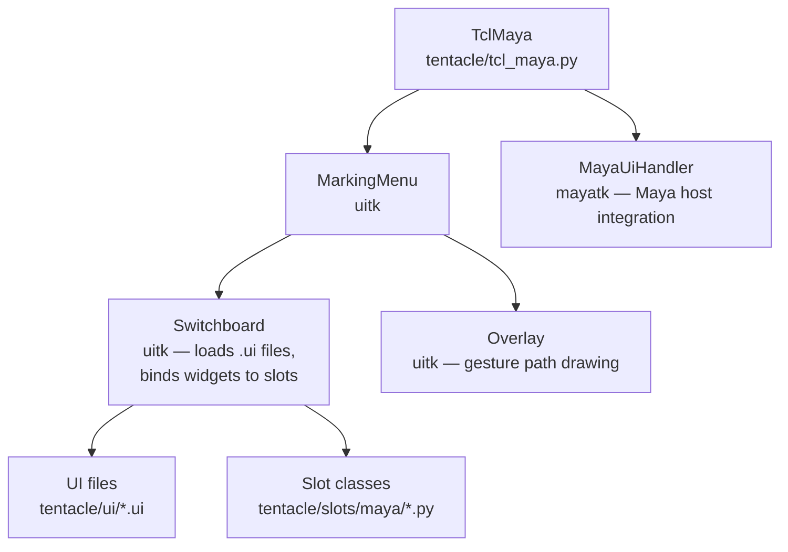

[](test/)
[](https://www.gnu.org/licenses/lgpl-3.0.en.html)
[](https://pypi.org/project/tentacletk/)

# Tentacle

**A Qt-based marking menu (pie menu) for DCC apps, with a full toolkit for Maya.**

Tentacle gives you a fast, gesture-driven launcher for tools and commands inside Autodesk Maya, 3ds Max, and Blender. Press a hotkey, flick the mouse toward a wedge, release — and the tool runs. Submenus open along the gesture path, so common multi-step actions become single muscle-memory motions.

It ships with **60+ pre-built Maya tool panels** (modeling, UVs, materials, rigging, animation, rendering, …) covering most day-to-day work. The Blender and 3ds Max entry points are scaffolded but do not yet ship a slot library.


---

## Table of contents

- [Why Tentacle](#why-tentacle)
- [Install](#install)
- [Launch](#launch)
- [How it works](#how-it-works)
  - [Default key bindings](#default-key-bindings)
  - [Marking-menu interaction](#marking-menu-interaction)
  - [UI ↔ slot wiring](#ui--slot-wiring)
- [Project layout](#project-layout)
- [Adding your own menu](#adding-your-own-menu)
- [Customization](#customization)
- [Platform support](#platform-support)
- [Development](#development)
- [Further reading](#further-reading)

---

## Why Tentacle

- **Gesture-first.** Activate from anywhere, never break flow to hunt through Maya's shelf or menu bar.
- **Convention over configuration.** A `.ui` file plus a Python class with matching method names (`b005` → `def b005(...)`) is all it takes to add a tool.
- **Composable.** UIs and slots are decoupled — swap the front-end without touching command logic.
- **Battery-included for Maya.** Ships with curated panels for nearly every DCC discipline — see [`tentacle/slots/maya/`](../tentacle/slots/maya).

## Install

Tentacle is published to PyPI as `tentacletk`. Install into your DCC's bundled Python (Maya example):

```bash
"C:/Program Files/Autodesk/Maya2025/bin/mayapy.exe" -m pip install tentacletk
```

Or use the [mayapy package manager](https://github.com/m3trik/windows-shell-scripting/blob/master/mayapy-package-manager.bat) (give your Maya version, press `1`, type `tentacletk`).

**Requirements:** Python 3.9+, Qt via `qtpy` (PySide2 or PySide6), and the upstream toolkit packages [`pythontk`](https://github.com/m3trik/pythontk), [`uitk`](https://github.com/m3trik/uitk), and [`mayatk`](https://github.com/m3trik/mayatk) (installed automatically as dependencies).

## Launch

Add to your Maya `userSetup.py`:

```python
from maya.utils import executeDeferred

def start_tentacle():
    from tentacle import TclMaya
    TclMaya(key_show="F12")  # Hold F12 to summon the marking menu

executeDeferred(start_tentacle)
```

`key_show` accepts either bare keys (`"F12"`, `"Space"`) or fully-qualified Qt names (`"Key_F12"`).

To launch standalone for development:

```bash
python -m tentacle.tcl_maya
```

---

## How it works



`TclMaya` is a thin Maya-flavored subclass of [`uitk.MarkingMenu`](../../uitk/uitk/widgets/marking_menu/_marking_menu.py). All the heavy lifting — input state machine, gesture overlay, dynamic UI loading, slot binding — lives in `uitk`. Tentacle's job is to provide:

1. The Maya host wiring (parent window, UI handler).
2. Default key/mouse-button → start-menu bindings.
3. The library of `.ui` files and matching slot classes.

### Default key bindings

With the default `key_show="F12"`:

| Gesture                        | Opens             |
| ------------------------------ | ----------------- |
| `F12`                          | `hud#startmenu`   |
| `F12` + Left Mouse             | `cameras#startmenu`   |
| `F12` + Middle Mouse           | `editors#startmenu`   |
| `F12` + Right Mouse            | `main#startmenu`      |
| `F12` + Left + Right (chord)   | `maya#startmenu`      |

Inside any menu, `Ctrl+Shift+R` repeats the last command. Override the bindings or shortcut via [`Customization`](#customization).

### Marking-menu interaction

1. **Press and hold** the activation key — a radial menu appears centered on the cursor.
2. **Drag** toward a wedge. A trailing path is drawn so you can see your gesture history.
3. **If the wedge has a submenu**, it opens along the path — keep dragging.
4. **Release** over a leaf wedge to invoke its slot.

Tap-and-release without dragging shows the menu pinned, so you can click items directly.

### UI ↔ slot wiring

Tentacle relies on naming conventions, enforced by tests in `test/test_ui_integrity.py` and `test/test_slot_integrity.py`:

| Convention                                              | Example                                |
| ------------------------------------------------------- | -------------------------------------- |
| UI file name → menu identity                            | `materials.ui`, `main#startmenu.ui`    |
| Widget `objectName` → slot method                       | `b005` → `def b005(self)`              |
| Optional setup hook                                     | `def b005_init(self, widget)`          |
| Header section initializer                              | `def header_init(self, widget)`        |
| Info button (`i###`) `accessibleName` → submenu UI name | `i000.accessibleName = "polygons"`     |

Widget prefixes carry semantic meaning, recognized by `Switchboard`:

| Prefix       | Widget kind                  |
| ------------ | ---------------------------- |
| `b###`       | `QPushButton`                |
| `tb###`      | Tool button (with option box)|
| `cmb###`     | `QComboBox` / dropdown       |
| `list###`    | Expandable list              |
| `chk###`     | Checkbox                     |
| `lbl###`     | Label (clickable)            |
| `i###`       | Info / submenu router        |

## Project layout

```
tentacle/
├── tcl_maya.py            # Maya entry point — TclMaya class
├── tcl_max.py             # 3ds Max wrapper (TclMax)
├── tcl_blender.py         # Blender wrapper (TclBlender)
├── slots/
│   ├── _slots.py          # Base Slots class — repeat-last-command shortcut
│   └── maya/
│       ├── _slots_maya.py # SlotsMaya base for all Maya slot classes
│       ├── materials.py   # MaterialsSlots — example slot module
│       ├── animation.py
│       └── ... (~55 modules covering all DCC disciplines)
└── ui/
    ├── *.ui               # Top-level menu definitions
    ├── *#startmenu.ui     # Wedges for the radial start menus
    ├── *#submenu.ui       # Submenu panels reached via i### routers
    └── maya_menus/        # Maya-specific submenus
```

Each slot module pairs with one or more `.ui` files of the same basename. The `Switchboard` resolves the pair at load time.

## Adding your own menu

Minimal recipe to add a new tool panel:

1. **Create the UI** in Qt Designer and save as `tentacle/ui/my_tools.ui`. Add buttons and set their `objectName` to follow the prefix convention (`b000`, `b001`, …).
2. **Create the slot class** at `tentacle/slots/maya/my_tools.py`:

   ```python
   from tentacle.slots.maya._slots_maya import SlotsMaya

   class MyToolsSlots(SlotsMaya):
       def __init__(self, switchboard):
           super().__init__(switchboard)
           self.ui = self.sb.loaded_ui.my_tools

       def b000_init(self, widget):  # optional setup hook
           widget.setToolTip("Run the thing.")

       def b000(self):
           print("Hello from my_tools b000")
   ```

3. **Wire it into a start menu** by adding an info-button (`i###`) to e.g. `main#startmenu.ui` whose `accessibleName` equals `"my_tools"`. Or bind it directly to a key via the `bindings` argument to `TclMaya`.

The package's tests will fail if a UI/slot pair is mismatched, so structural mistakes are caught early.

## Customization

`TclMaya` accepts overrides for activation key, bindings, slot directory, and log level:

```python
from tentacle import TclMaya

TclMaya(
    key_show="F11",                   # change activation key
    slot_source="my_studio/slots",    # use a custom slot library
    log_level="DEBUG",                # uitk MarkingMenu log verbosity
    bindings={                        # fully replace the default bindings
        "Key_F11": "main#startmenu",
        "Key_F11|RightButton": "cameras#startmenu",
    },
)
```

User-facing preferences (shortcut for *Repeat Last Command*, theming, etc.) can be edited in-app via the **Preferences** panel — see [`slots/maya/preferences.py`](../tentacle/slots/maya/preferences.py).

## Platform support

| DCC         | Status                                                                  |
| ----------- | ----------------------------------------------------------------------- |
| Maya 2025+  | **Full** — entry point, ~55 slot modules, all default menus wired.      |
| Blender     | Wrapper class only ([`TclBlender`](../tentacle/tcl_blender.py)). No bundled slot library. |
| 3ds Max     | Wrapper class only ([`TclMax`](../tentacle/tcl_max.py)). No bundled slot library.         |

Contributions of Blender / Max slot suites are welcome.

## Development

Clone and install in editable mode:

```bash
git clone https://github.com/m3trik/tentacle
pip install -e ./tentacle
```

Run the structural test suite:

```bash
cd tentacle
python -m pytest test/
```

The CI workflow ([.github/workflows/tests.yml](../.github/workflows/tests.yml)) runs:

- `test_package.py` — package metadata sanity
- `test_slot_integrity.py` — widget-name ↔ slot-method binding coverage
- `test_ui_integrity.py` — UI/slot file pairing
- Module-specific suites (e.g. `test_rendering.py`)

For ad-hoc reproductions, drop scripts into `test/temp_tests/` (gitignored from the regular run).

## Further reading

- **[`API_REGISTRY.md`](../API_REGISTRY.md)** — auto-generated, exhaustive list of every public class/method with file:line links.
- **[`API_CHANGES.md`](../API_CHANGES.md)** — diff vs. previous registry refresh.
- **[`CHANGELOG.md`](../CHANGELOG.md)** — notable behavioral and feature changes.
- **[`CLAUDE.md`](../CLAUDE.md)** — engineering conventions for contributors / agents.
- **Upstream packages** — [pythontk](https://github.com/m3trik/pythontk) (utilities), [uitk](https://github.com/m3trik/uitk) (Switchboard + MarkingMenu engine), [mayatk](https://github.com/m3trik/mayatk) (Maya helpers).

## License

Tentacle is released under the [LGPL v3](https://www.gnu.org/licenses/lgpl-3.0.en.html).
